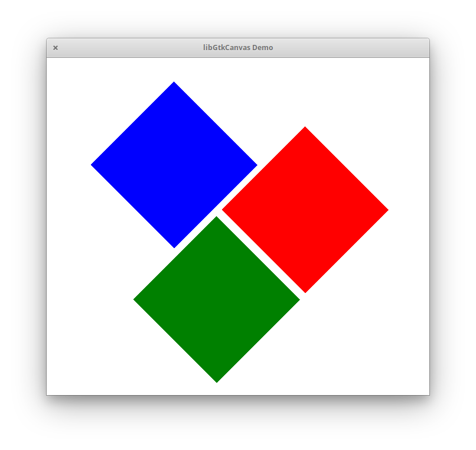

# GCanvas

This is the shared canvas specially built for [Akira](https://github.com/Alecaddd/Akira) and [Spice-Up](https://github.com/Philip-Scott/Spice-up). It will be written in Vala and use clutter for the drawing.

It is meant to contain the basic elements such as a basic container class, move, resize and rotate. As well as the ability to have custom shapes and be able to drag each of their individual points.

### Dependencies:

- clutter-1.0
- gtk+-3.0
- clutter-gtk-1.0
- granite

#### For SVG support

- gsvgtk-0.8
- librsvg-2.0
- gsvg-0.4
- gxml-0.16

### To compile & run the demo

#### Meson Build

This builds the Library, GObject Introspection, demo and documentation are build after this

```
mkdir build
cd build
meson ..
ninja
```

#### Run demo

```
./demo/gtkcanvas-demo
```

#### View Docs

```
xdg-open docs/GtkCanvas-0.4/GtkCanvas.html
```

<p align="center">
    
</p>
